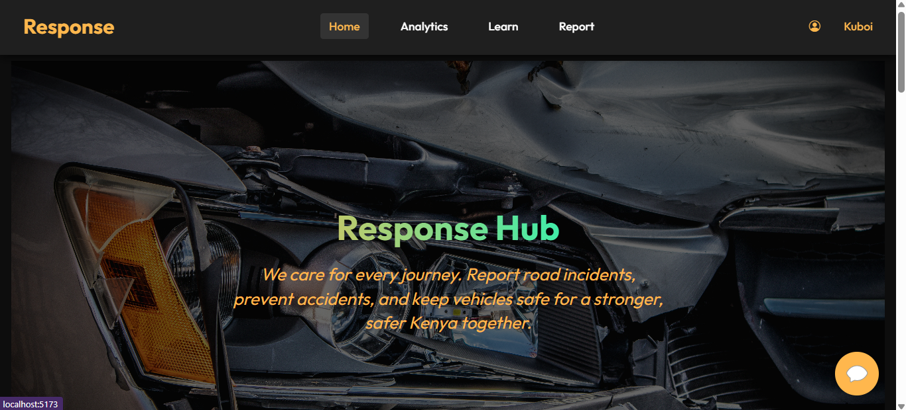
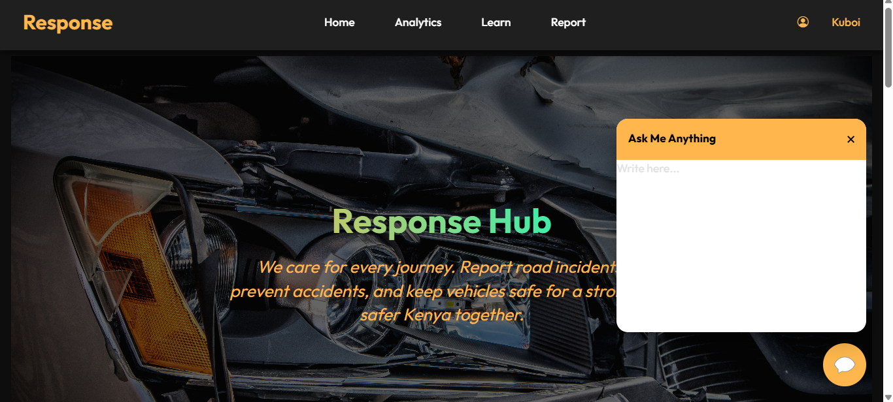
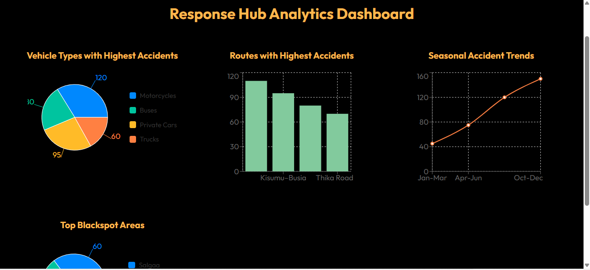
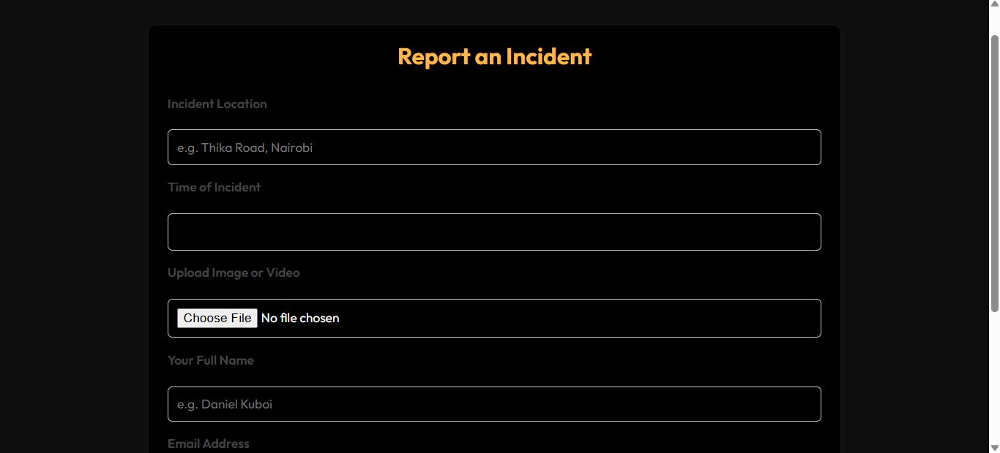
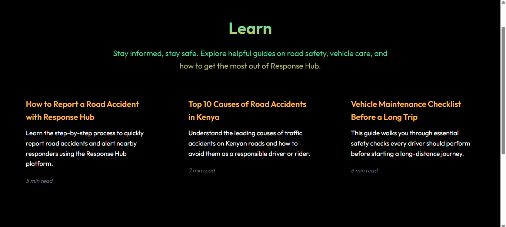
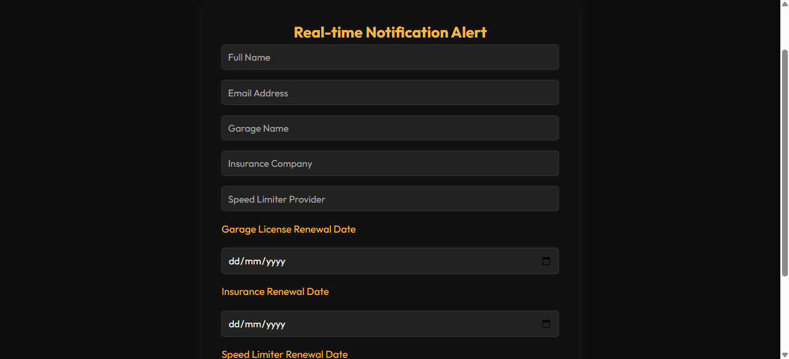

### Response Hub
 Accidents in Kenya are claiming over 4000 lives annually according to the NTSA, this  are caused by factors like reckless driving, poor road condition, overloading, weak enforcement of traffic laws, lack of vehicle maintainance, lack of enough information and lack of education on road safety. Response hub tries to solve these problems by providing solutions to every factor that couses rise in loss of lives in Kenya.

## Table of Contents
- [Introduction](#intro)
- [Features](#features)
- [Tech Stack](#tech)
- [Home](#home)
- [Automated Chatbot](#chatbot)
- [Real-time-Analytics](#analytics)
- [Report](#report)
- [Vehicle Health](#vehiclehealth)
- [Installation](#installation)
- [Prequesities](#prequesities)
- [Using Project](#project)
- [Contributing](#contributing)
- [Fork Repository](#fork)
- [Authors](#authors)
- [Licence](#licence)

## Introduction
 This project tries to solve each factor that causes road accident in Kenya through a blend of technologies that runs on a web, The system has automated chatbot where one can ask a chatbot any question concerning road safety and get real time answers. It also solve the problem lack of information through real time analytic dashboard to create awereness of the most dangerous routes in Kenya, seasons that expirience high accident rates, types of vehicles that are at risk of getting involved in accidents to make road users careful when encountering such places and events. It also has a page where road users can report incidents and accidents that happen on the road, to ensure swift operation of sectors involved in Road manintainance, Vehicle health page provide real time notification to drivers when it's time to take vehicle for checkup, renewing licence and insurance, learn page enables road users get get educated on road safety, road signs and other important stuffs that they need to be aware of.

## Features
- Automated chatbot
- Real-time Analytics
- Report 
- Vehicle health
- Learn

## Tech Stack
* Frontend *
- Javascript
- React
- Axios
- Recharts
- React-router-dom

* Backend *
- Python
- Django
- DjangoRestFramework

* Database *
- PostgreSQL
- Redis

## Home
 This is the first page that displays whenever you run the code, it has navigation bar that enables one to naviagate across all the features of the application, It also contain an automated chatbot where one can directly start a conversation.
 

 ## Automated Chatbot
  This features enables user to interact with a chatbot in providing real time searches on matters concerning road safety for better and faster response, which may also be used in learning various techniques of combating road accidents in Kenya
 

 ## Real-time Analytics
  When it comes to matters concerning real time analytics on what happens on the road, the application got you covered. It provides data that give insights road users wisdom while using the road, by providing road routes that are danger zone, seasons where road accidents are high, types of vehicles that are mostly involced in accidents among others. This help road user to be more careful with the roads.
 

 ## Report
  The application provides a page where road users can report incidents like poor road conditions, reckless driving, accidents etc through video and image uploading, areas where it has accured, time and date the it accured etc to help faster response from the ministry of Roads 
 

 ## Learn
  This page has tutorials, videos and documents that road users can access to get educated on matters concering road safety, first aid skills to save lives when accidents occurs, which can highly help to reduce road accidents in Kenya  
 

 ## Vehicle health
  This feature is found under the account nav element, where user can create an account, and fill a form that contains date of taking vehicles to the checkup, renewing insurance, and licence, and get real-time notification when the time to do any of the counts down, this will enable drivers have vehicles that are always in good condition hence reducing accidents caused by brake failures and others
  

 ## Installation
 - [Python 3.x](https://www.python.org/downloads/)
- [pip package manager](https://pip.pypa.io/en/stable/installation/)
- [git](https://git-scm.com/downloads)
- [node](https://www.node.org/downloads)

## Using project
1. Clone or download the repository:

  ` git clone https://github.com/dan9el8/Response_Hub`

  2. Go to the project directory

  ` cd Response_Hub `

  3. Create a virtual environment :

  PowerShell:
  ```
   python -m venv venv
   venv\Scripts\Activate.ps1
  ```
  
  Linux:
  ```
  python3 -m venv venv
  source venv/bin/activate
  ```

## Contributing
All contributions are welcomed !!

## Fork Repository
- Create a branch with your feature: `git checkout -b my-feature`;

- Commit your changes: `git commit -m "feat: my new feature"`;

- Push to your branch: `git push origin my-feature`.

## Author
- [dan9el8](https://www.github.com/dan9el8)

## Licence
This project is under [MIT License.]